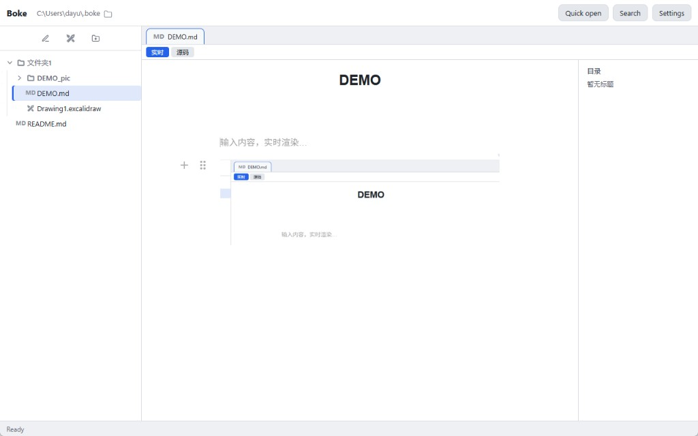

# Chestnut Editor（栗子编辑器）

**Chestnut Editor — 面向本地 Markdown 与 Excalidraw 的桌面编辑器。**

[English](README.md) · 中文（简体）

仓库：[github.com/nine-waited/ChestnutEditor](https://github.com/nine-waited/ChestnutEditor)

---

Chestnut Editor 是一款 **Tauri 2** 桌面应用，在你选择的本地文件夹中直接读写普通文件。知识库就是磁盘上的文件，没有专有数据库，也不依赖云端。npm 包作用域为 `@chestnut/*`，知识库内配置目录为 `.chestnut/`。

## 界面截图



## 面向开发者

### Monorepo 结构

```
ChestnutEditor/
├── apps/desktop              # Tauri 2 壳层（@chestnut/desktop）
├── packages/
│   ├── core                  # 知识库服务、元数据、搜索（@chestnut/core）
│   ├── ui                    # React 界面（@chestnut/ui）
│   ├── storage-adapters      # 本地文件系统适配器（@chestnut/storage-adapters）
│   └── plugin-sdk            # 插件 API 类型（@chestnut/plugin-sdk）
├── examples/sample-vault/    # 本地测试用示例知识库
└── docs/                     # 架构与插件文档
```

详见 [docs/architecture.md](docs/architecture.md)：知识库目录、元数据流水线与插件机制。

### 环境要求

| 依赖 | 说明 |
|------|------|
| Node.js 20+ | 必需 |
| pnpm 9+ | 根目录 `package.json` 已锁定 `packageManager` |
| Rust（rustup） | Tauri 原生构建 |
| Windows：MSVC 构建工具 | 勾选 **「使用 C++ 的桌面开发」**；构建目标为 `x86_64-pc-windows-msvc` |
| [Tauri 环境说明](https://v2.tauri.app/start/prerequisites/) | 各平台补充要求 |

Windows 建议开启 **开发人员模式**；若 Rust 构建脚本被拦截，可关闭「智能应用控制」。

### 安装与开发

```bash
git clone https://github.com/nine-waited/ChestnutEditor.git
cd ChestnutEditor
pnpm install
pnpm dev
```

- `pnpm dev` 以 MSVC 目标运行 `tauri dev`（内嵌 Vite 端口 **1420**，不是独立 Web 站点）。
- 首次启动打开 **`~/.chestnut`**（不存在则自动创建）。
- 示例知识库：将工具栏路径指向 `examples/sample-vault`。

根目录其他脚本：

| 脚本 | 用途 |
|------|------|
| `pnpm typecheck` | 全包 TypeScript 检查 |
| `pnpm test` | 运行各包测试 |
| `pnpm build:desktop` | Tauri 发布构建（x64 MSVC） |
| `pnpm build:desktop:win64` | 清理桌面构建缓存后发布构建 |
| `pnpm clean:desktop` | 删除桌面构建产物 |

**Windows 安装包（x64 NSIS）：**

```bash
pnpm build:desktop:win64
```

输出：`apps/desktop/src-tauri/target/x86_64-pc-windows-msvc/release/bundle/nsis/Chestnut_*-setup.exe`

### 桌面应用图标

应用内顶栏显示 **Chestnut** 文字品牌；窗口、任务栏与安装包图标使用内置 PNG 素材生成。

更换图标源图后：

```bash
cd apps/desktop
pnpm tauri icon public/app-icon-source.png
# Windows PowerShell — 同步 Web favicon：
Copy-Item src-tauri/icons/128x128.png public/favicon.png -Force
```

源图：`apps/desktop/public/app-icon-source.png`（1024×1024）。说明见 [apps/desktop/src-tauri/icons/README.md](apps/desktop/src-tauri/icons/README.md)。

### 知识库约定（贡献者）

| 项 | 约定 |
|----|------|
| 默认知识库路径 | 桌面端首次启动 `~/.chestnut` |
| 知识库内应用配置 | `.chestnut/`（插件、主题等） |
| 笔记 / 绘图 | `.md`、`.excalidraw` |
| 粘贴的图片 | 笔记旁 `{笔记名}_pic/` |
| 删除 | 桌面端移入系统回收站 |

**知识库内欢迎文档（非本文件）：** 挂载知识库时，若缺失会在根目录创建 `README_en.md` 与 `README_cn.md`（`packages/ui/src/default-readme.ts`），供终端用户阅读；本仓库 README 面向开发者。

### 国际化

- 应用界面：**English**、**简体中文**（设置 → 语言）。
- 文案目录：`packages/ui/src/i18n/messages.ts`。
- 知识库欢迎 README 见上节。

### 插件开发

见 [docs/plugin-guide.md](docs/plugin-guide.md)。插件从 `.chestnut/plugins/{id}/` 以 ES 模块加载，通过白名单 API 与宿主交互。

---

## 功能概览（当前版本）

**知识库与文件树**

- 工具栏可编辑知识库路径；文件夹选择；复制路径
- 可拖拽调整宽度、可折叠的文件侧栏（拖边界；双击标签栏可切换显示）
- 新建、重命名、删除；删除进回收站
- 拖拽移动（幽灵预览）；拖到树外视为移到知识库根目录
- 在树中定位当前文件；一键折叠全部文件夹
- 右键菜单：Markdown 导出 PDF、批量关闭标签等

**Markdown**

- 实时预览（Milkdown）与源码模式（CodeMirror）
- `[[双链]]`、`![[嵌入]]`、`#标签`、YAML frontmatter
- 大纲面板；标题栏重命名笔记文件
- 粘贴或拖拽图片；保存在 `{笔记名}_pic/`
- 实时模式下选中图片、编辑说明、可选清理 `_pic` 孤儿文件
- 图片灯箱（工具栏或双击）；从文件树或笔记打开图片查看器
- 导出 PDF，应用内预览与进度对话框

**Excalidraw**

- 应用内打开并编辑 `.excalidraw`；自动保存到知识库文件

**外观与设置**

- 浅色 / 深色主题（Markdown + Excalidraw）；偏好持久化
- 字体：微软雅黑、内置手写体（默认小赖体、悠哉体）；OFL 许可

**导航**

- 快速打开（默认 `Shift+Shift`）、全文搜索（默认 `Ctrl+Shift+F`）
- 可自定义快捷键；标签栏滚动与右键操作
- `Ctrl+S` 立即保存当前笔记或绘图

自动保存防抖：Markdown 约 400 ms，Excalidraw 约 600 ms。

## 界面说明

| 区域 | 说明 |
|------|------|
| **顶部工具栏** | 知识库路径（可编辑）、**Chestnut** 品牌、快速打开、搜索、设置 |
| **左侧边栏** | 新建笔记 / Excalidraw / 文件夹；文件树 |
| **编辑区（中间）** | 标签页；Markdown 实时 / 源码；标题栏 |
| **目录（右侧）** | 标题大纲；点击跳转 |
| **状态栏** | 应用状态（如 Ready） |

## 快捷键

| 操作 | 默认按键 |
|------|----------|
| 快速打开 | `Shift+Shift` |
| 全文搜索 | `Ctrl+Shift+F` |
| 保存 | `Ctrl+S` |

## 许可证

MIT — 见 [LICENSE](LICENSE)。
