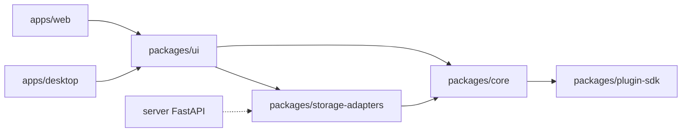

# Architecture

## Overview

Boke is a pnpm monorepo with shared TypeScript packages and two app shells (Web PWA, Tauri desktop).



## Vault layout

```
my-vault/
├── notes/*.md
├── attachments/*
├── .boke/
│   ├── plugins/{id}/manifest.json + main.js
│   └── themes/*.css
└── .obsidian/   (read-only compat, optional)
```

## Storage adapters

| Adapter | Runtime | Use case |
|---------|---------|----------|
| `TauriFsAdapter` | Desktop | Full FS access, best UX |
| `FileSystemAccessAdapter` | Chromium PWA | User-picked folder |
| `OpfsAdapter` | Any browser | Sandbox demo / fallback |
| `RemoteRestAdapter` | Web + Desktop | Server-backed vault |

All adapters implement `VaultAdapter` in `packages/core/src/vault/types.ts`.

## Metadata pipeline

1. On vault mount → `VaultService.reindex()` reads all `.md` files
2. `parseMarkdownFile()` extracts frontmatter, wikilinks, embeds, tags, headings
3. `MetadataCache` maintains backlink index and graph edges
4. `SearchIndex` (MiniSearch) indexes title + body + tags

## Plugin host

Plugins are ES modules loaded from `.boke/plugins/{id}/main.js` via dynamic `import()`. They receive a whitelisted `PluginApi` (no raw `fs` / `require`).

Lifecycle: `onLoad(api)` → register commands / status bar → `onUnload(api)` on disable.

## Security model

- Web plugins: API whitelist only
- Remote server: Bearer token, path traversal checks
- Tauri: native folder picker, scoped to user-selected root

## Blog publish (M4)

Notes with `publish: true` in frontmatter are listed in the Publish panel. Export generates concatenated HTML pages + RSS XML for static hosting.
